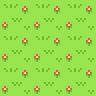
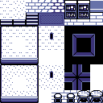
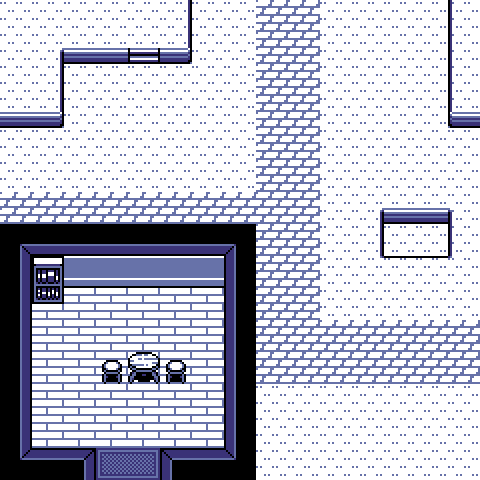

## Pixel Art

### DawnBringer's 32 Col Palette

The following graphics use the 
[DawnBringer 32](https://lospec.com/palette-list/dawnbringer-32) palette by
[DawnBringer](http://pixeljoint.com/p/23821.htm) and are released under the
[CC0 license](https://creativecommons.org/publicdomain/zero/1.0/).

### ARQ4

The following graphics use the [ARQ4](https://lospec.com/palette-list/arq4)
palette by [Endesga](https://twitter.com/ENDESGA) and are released under the
[CC0 license](https://creativecommons.org/publicdomain/zero/1.0/).

